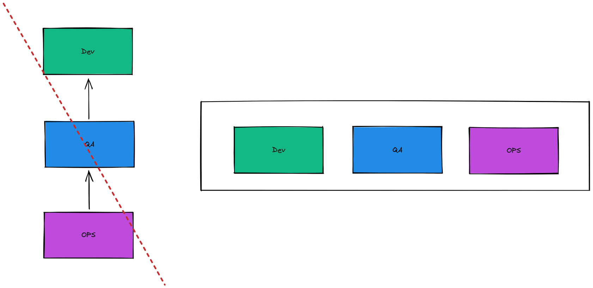

# Premier Idéal: localité et simplicité

- Localité des systèmes
- Localité des organisations
- Simplicité du code, des organisations, des processus

# Deuxieme Idéal: concentration, flow, joie

- Apprentissage, découvertes, dépassement de soi, maitrise du métier
- Ne pas dépendre des autres
- Ne pas avoir le nez que sur son boulot
- Ne pas voir le résultat qu'au moment du déploiement
- Avoir des retours immédiat sur notre boulot

# Trosième Idéal: amélioration du travail quotidien

- Placer l'amélioration du travail quotidien au dessus du travail lui même

# Quatrième Idéal: sécurité psychologique

- Pas de répercutions, pas de craintes: être libre de dire ce que l'on pense vraiment sans avoir peur des représailles

# Cinquième Idéal: approche centré sur le client

- Peut on le vendre ou est-il limité à un silo fonctionnel

# Entités projet

- To edit file `entities.excalidraw`
- 
- Pas de hierarchi entre les différentes entités
